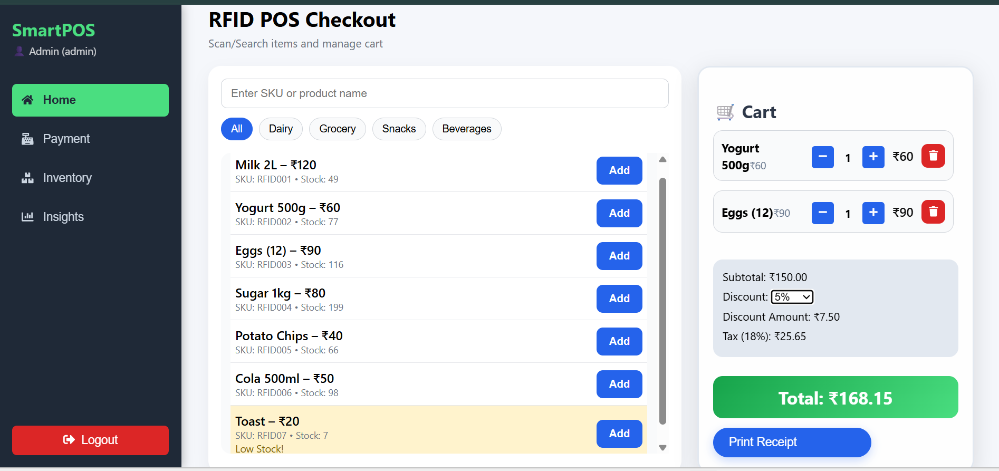
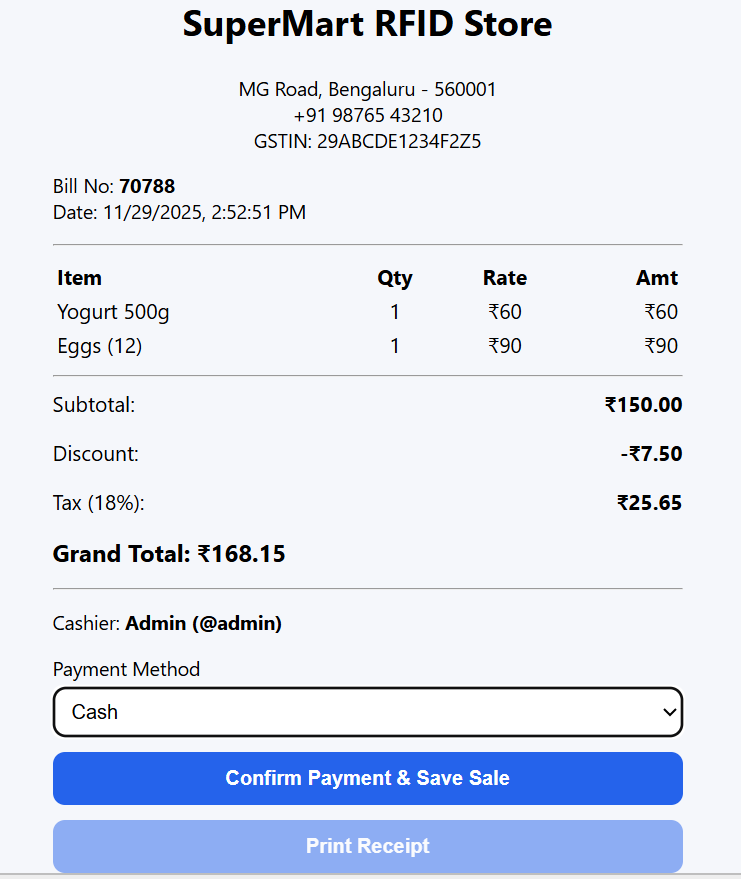
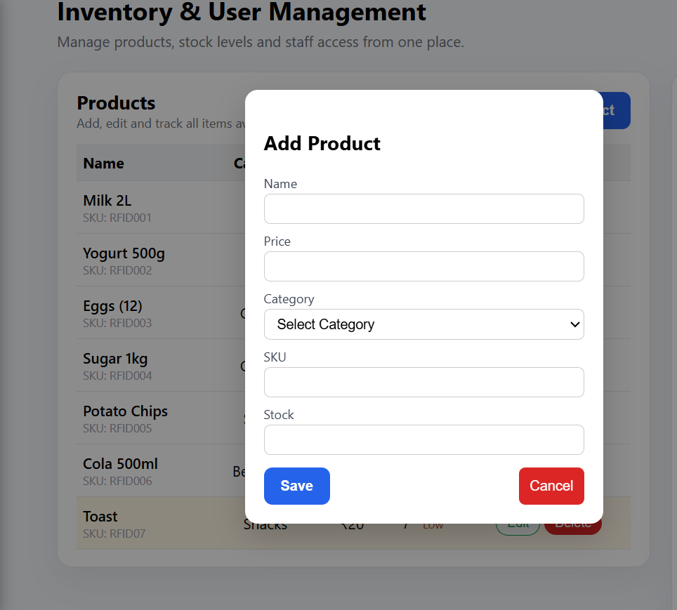
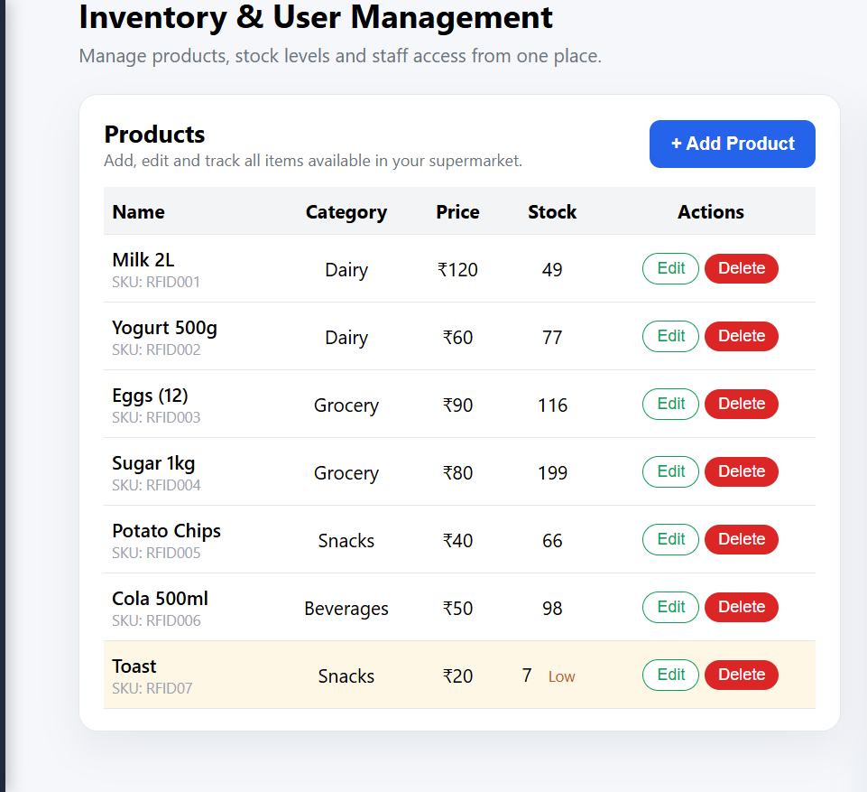
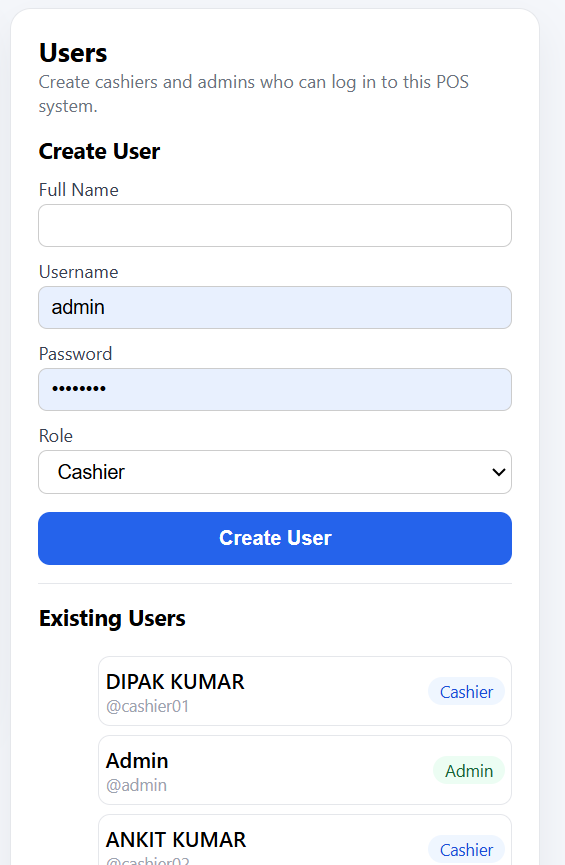
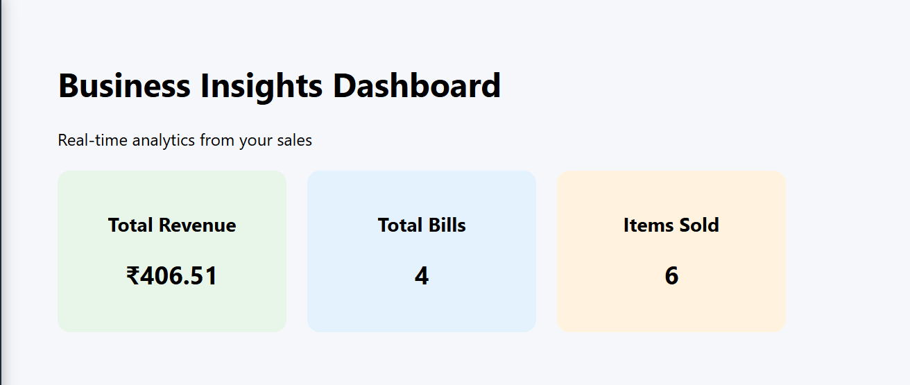
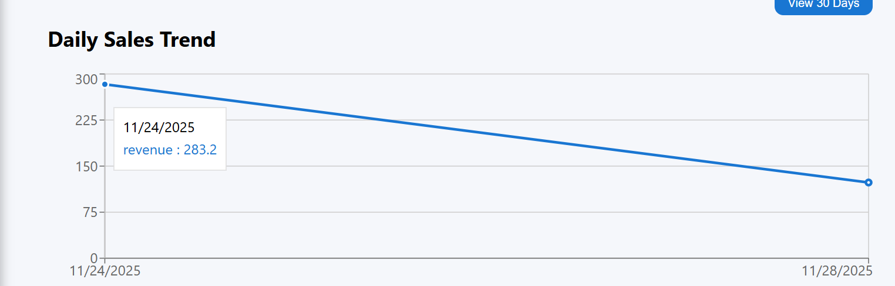
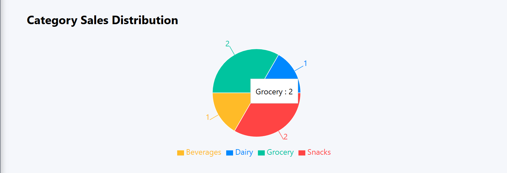
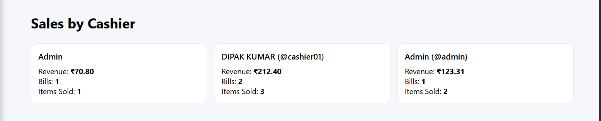
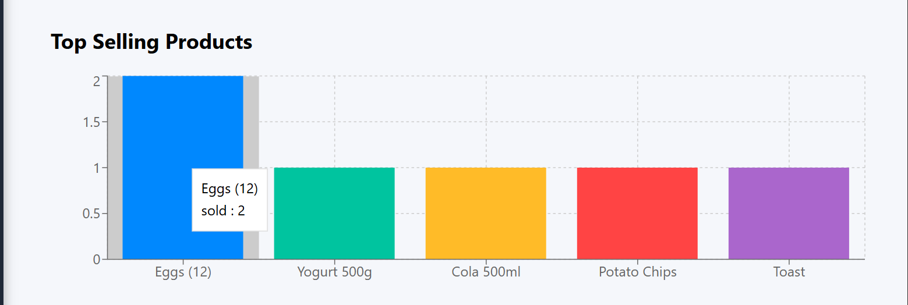

# Supermarket POS System

Full-featured supermarket POS (Point-of-Sale) application that handles **product cataloging**, **billing**, **stock management**, **receipt generation**, and **daily sales analytics**.

Built with **React + Vite** on the frontend and a **Node.js/Express + MongoDB** backend.

---

## Features

- Product & category management
- Billing / checkout flow
- Inventory & stock management
- Staff/user management
- Sales analytics dashboards:
  - Daily sales trend
  - Category-wise sales distribution
  - Sales by cashier
  - Top selling products

---

## Screenshots

### Main Page


### Billing Page


### Add New Product Page


### Inventory & User Management


### New Staff Account Creation


### Dashboard Overview


### Daily Sales Trend Dashboard


### Category Sales Distribution Dashboard


### Sales by Cashier Dashboard


### Top Selling Products Dashboard


---

## Tech Stack

### Frontend
- React
- Vite
- Tailwind CSS
- React Router
- Recharts

### Backend
- Node.js + Express
- MongoDB + Mongoose
- JWT Authentication
- bcrypt

---

## Getting Started (Frontend)

### Prerequisites
- Node.js (recommended: latest LTS)
- npm

### Install & Run
```bash
npm install
npm run dev
```

---

## Getting Started (Backend)

> Backend code lives in `backend/`.

```bash
cd backend
npm install
node index.js
```

---

## Environment Variables (Backend)

Create a `.env` file inside `backend/` (example keys — update as per your code):

```env
MONGO_URI=your_mongodb_connection_string
JWT_SECRET=your_secret_key
PORT=5000
```

---

## Project Structure (High-level)

```plaintext
.
├── backend/
├── public/
│   └── screenshots/
├── src/
├── index.html
├── package.json
└── README.md
```

---

## Author

- **Ankit Kumar** — [@KumarAnkit40](https://github.com/KumarAnkit40)
